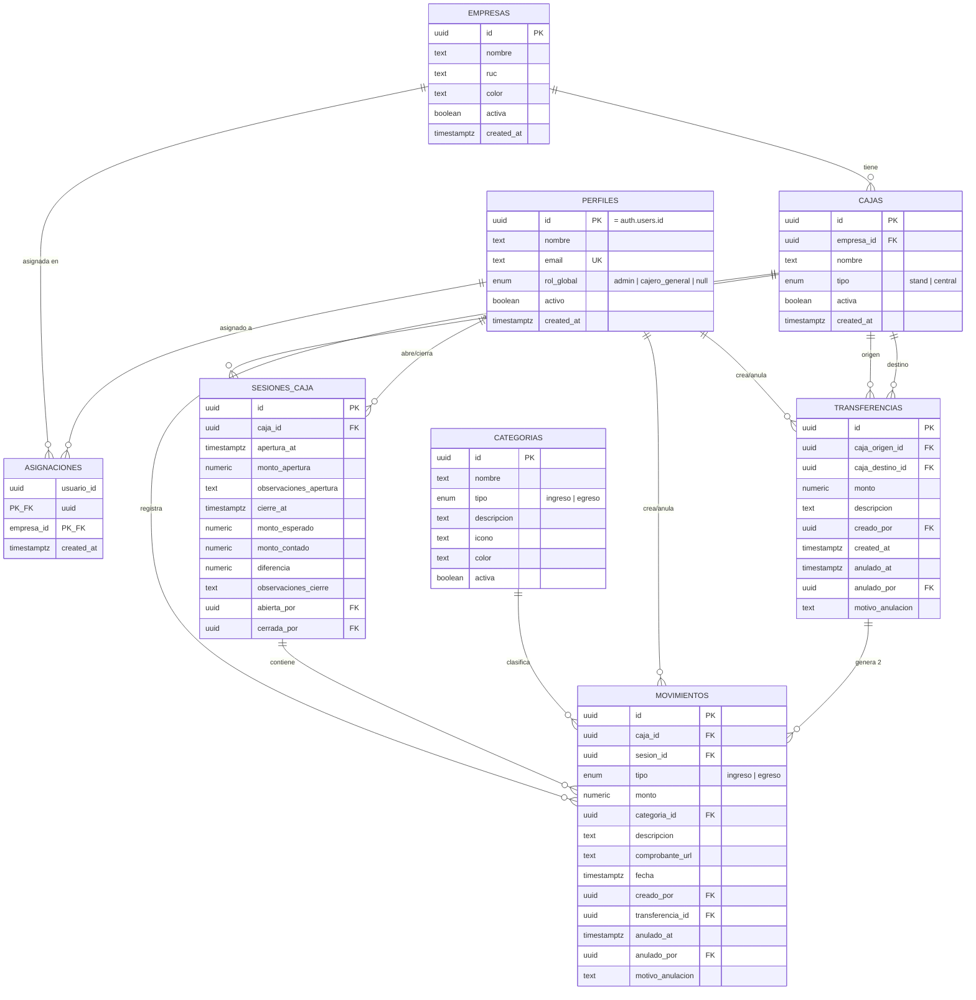

# ERD — SCBox

Diagrama entidad-relación generado desde `docs/schema.sql`. No incluye `auth.users` (gestionada por Supabase) más que como referencia externa de `perfiles`.

## Notas de lectura

- `ASIGNACIONES` es la tabla puente que define qué "encargado" (perfil con `rol_global is null`) ve qué empresas. `admin` y `cajero_general` no necesitan filas aquí: su acceso es global vía `puede_operar_todas()`.
- `MOVIMIENTOS.transferencia_id` es opcional: null en movimientos normales, presente en los 2 movimientos generados por una `TRANSFERENCIAS`.
- No hay tabla de "saldos": el saldo por caja es la vista calculada `saldos_cajas` (ver [BUSINESS_RULES.md](BUSINESS_RULES.md#el-saldo-nunca-se-almacena)), por eso no aparece en este ERD como entidad con columnas propias más allá de ser una proyección de `CAJAS` + `SESIONES_CAJA` + `MOVIMIENTOS`.
